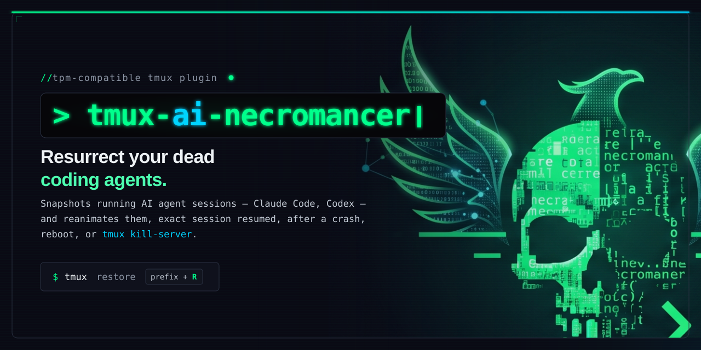

# 🪦 tmux-ai-necromancer 🪦



> Bring your dead AI coding sessions back to life.

`tmux-ai-necromancer` is a [TPM](https://github.com/tmux-plugins/tpm)-compatible
tmux plugin that does for **AI coding agent sessions** what
[tmux-resurrect](https://github.com/tmux-plugins/tmux-resurrect) does for tmux
panes: it snapshots your running agent conversations on a timer and resurrects
them — with the exact session resumed — after a crash, reboot, or
`tmux kill-server`.

It is **multi-agent**: [Claude Code](https://claude.com/claude-code) and
[Codex](https://developers.openai.com/codex/cli/) work out of the box, and
adding another agent is one small adapter file.

Born from a real problem: tmux 3.6b crashes (heap corruption in copy mode) kept
killing a dozen live Claude Code sessions at once, with no way to get them back.

## What it does

- **Pane watcher** — a per-tick hook that detects agent panes the moment they
  start (or exit) and pins the session UUID directly to the pane, so autosave
  never has to guess. Handles command aliases (`cc` for `claude`, etc.).
- **Autosave** — every 5 minutes (configurable), walks every tmux pane and
  records each pane's agent + resumable session id to a JSONL snapshot. Prefers
  watcher-pinned UUIDs; falls back to filesystem heuristics. Runs in the
  background off the status bar; **never touches a running agent**.
- **Restore** — reads the latest snapshot and recreates sessions/windows,
  running the right resume command per agent (`claude --resume <id>`,
  `codex resume <id>`, …). **Idempotent** — safe to run repeatedly on a
  half-populated server; it fills gaps instead of duplicating windows or
  erroring out.
- **Reboot survival** — `prep`/`resume` wrappers that pair with tmux-resurrect +
  tmux-continuum to bring the whole layout (and every agent) back after a reboot.
- **Session viewer (TUI)** — a Go + Bubble Tea viewer/capture tool that joins
  live panes against the latest snapshot and can exit supported agents on demand.

## Install

### With TPM (recommended)

Add to `~/.tmux.conf`:

```tmux
set -g @plugin 'RonenMars/tmux-ai-necromancer'
```

Then press `prefix + I` to install. That's it — the autosave daemon starts immediately.

### Manual

```bash
git clone https://github.com/RonenMars/tmux-ai-necromancer \
  ~/.tmux/plugins/tmux-ai-necromancer
run-shell ~/.tmux/plugins/tmux-ai-necromancer/tmux-ai-necromancer.tmux  # in tmux.conf
```

### Dependencies

- `tmux` ≥ 3.0
- `python3` (JSON handling — ships with macOS)
- `jq` (restore/apply — `brew install jq`)
- `go` ≥ 1.21 (only to build the optional TUI)

### Windows (WSL2 only)

There is no native-Windows build. Every script reads its state from `tmux`
(`list-panes`, `set-option -p`, `send-keys`), so the plugin needs a real tmux
server — run it inside a WSL2 distro:

```bash
sudo apt install tmux jq python3
# then install via TPM as above
```

Launch `claude` / `codex` from inside a WSL tmux pane. Agents started in
Windows Terminal / PowerShell are invisible to the plugin: they aren't tmux
panes, and their transcripts live under `C:\Users\<you>\.claude\projects\`
while the adapters resolve `$HOME/.claude/projects` (the WSL home).

Two WSL-specific notes:

- Keep `@necromancer_snapshot_dir` on the WSL filesystem, not `/mnt/c`. The
  autosave and watcher locks rely on `mkdir` being atomic, which drvfs doesn't
  guarantee, and the pane walk is far slower across the mount.
- The menu's *Prep + shutdown* option runs `sudo shutdown -h now`, which halts
  the distro rather than Windows. Run `necro-reboot-prep.sh` on its own, reboot
  Windows, then start WSL → `tmux` → `necro-reboot-resume.sh`. The pinned
  snapshot survives on disk.

The one script that does run natively is `scripts/necro-clean-debug-logs.py`
(`py necro-clean-debug-logs.py`) — see
[`docs/DEBUG_LOGGING.md`](docs/DEBUG_LOGGING.md).

## Usage

| Action | Command / key |
|---|---|
| Restore latest snapshot | `prefix + R` (popup), or `necro-restore.sh` |
| Manual snapshot (no disruption, default) | `necro-snapshot.sh` |
| Manual snapshot (interactive exit-capture) | `necro-snapshot.sh --interactive` |
| Restore a specific snapshot | `necro-restore.sh <file.jsonl>` |
| Dry-run a restore | `necro-restore.sh --dry-run` |
| Before reboot | `necro-reboot-prep.sh` (or `safe-reboot` / `safe-shutdown` aliases) |
| After reboot | `necro-reboot-resume.sh` |
| Prune idle-shell windows | `necro-prune.sh` (`--dry-run` to preview) |
| Reorganize LIVE panes into sessions | `necro-apply.sh <file.jsonl>` (see note below) |
| Interactive menu | `necro-menu.sh` |
| Session viewer | `make -C tui run` |

Scripts live in `scripts/` inside the plugin dir
(`~/.tmux/plugins/tmux-ai-necromancer/scripts/`). Add it to `PATH` or alias the
ones you use.

`necro-restore.sh` restores a snapshot you choose explicitly. `necro-reboot-resume.sh`
is the reboot wrapper behind `necro-resume`; it finds the pinned reboot snapshot,
ensures tmux is up, then calls restore for you.

`necro-apply.sh` is different: it operates on **live** panes rather than
rebuilding dead ones, moving each recorded pane's window into a destination
session and resuming the agent in place. Use it to reorganize a sprawling
server. Destination comes from the record's `dest_session`, else a routing
table at the top of the script — that table ships with example globs and you
will want to edit it for your own projects before using it.

### Recommended shell aliases

Add these to your shell config (`~/.zshrc`, `~/.bashrc`, `config.fish`, etc.):

```sh
# post-reboot: restore all AI sessions from last snapshot
alias necro-resume='~/.tmux/plugins/tmux-ai-necromancer/scripts/necro-reboot-resume.sh'

# interactive menu: browse/restore/cleanup snapshots, prep for reboot
alias necro-menu='~/.tmux/plugins/tmux-ai-necromancer/scripts/necro-menu.sh'

# prune tmux windows where every pane is an idle shell (keeps agents/editors/builds)
alias necro-prune='~/.tmux/plugins/tmux-ai-necromancer/scripts/necro-prune.sh'

# safe reboot/shutdown: snapshot all live sessions FIRST, then hand off to the OS.
# Use these instead of the Apple menu / system shutdown — see docs/TROUBLESHOOTING.md.
alias safe-reboot='~/.tmux/plugins/tmux-ai-necromancer/scripts/necro-reboot-prep.sh && sudo reboot'
alias safe-shutdown='~/.tmux/plugins/tmux-ai-necromancer/scripts/necro-reboot-prep.sh && sudo shutdown -h now'
```

> **Why `safe-reboot`?** The autosave runs every 5 minutes. If you close
> sessions manually before rebooting — or macOS starts killing processes during
> shutdown — the final autosave captures only what was still alive at that
> moment. `safe-reboot` runs `necro-reboot-prep.sh` first, snapshotting
> everything while all sessions are still open, then reboots. See
> [docs/TROUBLESHOOTING.md](docs/TROUBLESHOOTING.md) for details.

## Configuration

**All optional** — the plugin defaults every one of these itself, so the single
`set -g @plugin` line from [Install](#with-tpm-recommended) is enough on its own.
The values below are the defaults; pasting the block verbatim changes nothing.
Override only what you want to change, in `~/.tmux.conf` **before** the line that
loads TPM:

```tmux
set -g @necromancer_interval         '5'             # minutes between autosaves
set -g @necromancer_max_snapshots    '20'            # autosave files to keep
set -g @necromancer_agents           'claude codex'  # which agents to track
set -g @necromancer_restore_key      'R'             # prefix key for restore popup
set -g @necromancer_snapshot_dir     '~/.claude/tmux-snapshots'  # where snapshots live
set -g @necromancer_log_dir         '~/.tmux-ai-necromancer-logs'  # script logs
set -g @necromancer_debug           'off'           # write per-command debug logs
set -g @necromancer_autosave_tick   '60'            # autosave daemon polling interval in seconds
set -g @necromancer_watch_tick      '1'             # watcher daemon polling interval in seconds
set -g @necromancer_claude_commands  'claude'        # space-separated command names for Claude Code (add aliases, e.g. 'claude cc')
set -g @necromancer_codex_commands   'codex codex-*' # same, for Codex; entries are globs (the default covers the truncated native binary)
set -g @necromancer_resume_delay        '5'  # seconds to pause between resume batches
set -g @necromancer_resume_batch_size   '1'  # resumes launched per batch before pausing
set -g @necromancer_resume_message      'continue'  # text sent into each pane after resume ('' disables)
set -g @necromancer_resume_message_delay '8'  # seconds to wait before sending that message
```

Two more options govern restore safety —
`@necromancer_max_claude_transcript_bytes` and `@necromancer_unsafe_cwd_patterns`.
They're documented with their defaults in `necro-restore.sh --help` and under
[Troubleshooting](docs/TROUBLESHOOTING.md).

### Applying a config change later

Editing `~/.tmux.conf` alone does nothing — tmux options only change when the
file is re-read. How much you need to reload depends on the option:

| Options | To apply |
|---|---|
| Everything except the two below | `tmux source-file ~/.tmux.conf` — scripts read these at each run |
| `@necromancer_restore_key` | Same, then re-run the plugin file (`prefix + I`, or restart tmux). The old key stays bound until the server restarts. |
| `@necromancer_autosave_tick`, `@necromancer_watch_tick` | The daemons read their tick once at startup and a re-source is a no-op while they hold their lock. Restart them: `pkill -9 -f 'necro-.*-daemon\.sh'; tmux source-file ~/.tmux.conf` |

`-9` is deliberate in that last one. On a plain `TERM` the daemon's cleanup trap
is deferred until its in-flight `sleep` returns (up to a full tick), so the lock
is still held when you re-source and no new daemon starts. `SIGKILL` leaves a
stale lock instead, which the next daemon detects (the recorded pid no longer
matches a daemon process) and reclaims immediately.

`@necromancer_resume_delay` / `@necromancer_resume_batch_size` govern
`necro-restore.sh` and `necro-apply.sh`: launching several `claude --resume`
processes back-to-back (each reads a transcript and hits the API for initial
context) can spike CPU/memory enough to stall the machine on a large restore.
By default one resume launches, then the script pauses 5s before the next.
Raise `@necromancer_resume_batch_size` to let a few resumes fire together
before each pause, or override per-invocation with `--resume-delay N` /
`--resume-batch-size N` (or `NECROMANCER_RESUME_DELAY` /
`NECROMANCER_RESUME_BATCH_SIZE`).

After each resume, both scripts send a follow-up message into the pane —
`@necromancer_resume_message` (default `continue`) — so the resumed agent picks
up its in-progress task without you retyping anything. It waits
`@necromancer_resume_message_delay` seconds first (default 8) so the message
lands at the prompt, not on the agent's boot screen. Set the message to an empty
string (`''`, or `--resume-message ''`) to disable it. Caveat: if the last turn
ended by asking *you* a question, an auto-sent `continue` answers it blindly —
disable the message when that matters. Also configurable via `--resume-message` /
`--resume-message-delay` and `NECROMANCER_RESUME_MESSAGE` /
`NECROMANCER_RESUME_MESSAGE_DELAY`.

Snapshots also record each pane's `window_layout`, and restore replays it with
`select-layout` so a multi-pane window comes back with its original arrangement
and sizes — but only when the restored pane count matches the snapshot's, so a
partially-restored or user-modified window is never reshaped.

The snapshot dir defaults to `~/.claude/tmux-snapshots` (so it stays compatible
with prior Claude-only setups). Override with the option above or the
`NECROMANCER_SNAPSHOT_DIR` env var.

Set `@necromancer_debug` to `on` while investigating a problem. Each script
then writes structured lifecycle and action events to
`~/.tmux-ai-necromancer-logs/<script>.log`. Override the log location with
`@necromancer_log_dir` or `NECROMANCER_LOG_DIR`; set
`NECROMANCER_DEBUG=1` to enable it for one command. See the
[debug logging guide](docs/DEBUG_LOGGING.md) for cleanup, cross-platform use,
and expected disk usage.

The shell logs also include lifecycle records in the form
`event phase=<phase> action=<action>`, covering run startup, phases, records,
tmux mutations, skips, completions, and failures. The TUI writes matching
structured JSONL events to `~/.tmux-ai-necromancer-logs/tui.log` while debug
mode is enabled; it never writes scrollback or transcript contents.

## How it works

The plugin starts independent autosave and watcher daemons with
`tmux run-shell -b`; neither runs during `status-right` rendering. Autosave
polls every `@necromancer_autosave_tick` seconds (default 60), while the
one-shot job self-throttles to `@necromancer_interval` minutes (default 5).
The watcher polls every `@necromancer_watch_tick` seconds (default 1). Atomic
daemon locks make plugin reloads idempotent, and both daemons exit when the
tmux server disappears.

**Pane watcher** (`necro-watch.sh`) runs from the watcher daemon and maintains five tmux pane
options: `@necro_uuid`, `@necro_agent`, `@necro_cmd`, `@necro_agent_exited`, and
`@necro_pane_first_seen`. When an agent starts it pins the UUID immediately; when
it exits it sets the exited flag so autosave can log the closed session. The
first-seen stamp records when the pane's agent was first observed, so the
filesystem fallback can reject transcripts older than the pane itself.

**Autosave** (`necro-autosave.sh`) self-throttles to your interval and, when due,
runs a `--idle-only` snapshot in the background. An atomic `mkdir` lock prevents
concurrent daemon ticks or manual invocations from firing duplicate snapshots.
It also skips entirely during the first 90 seconds of machine uptime, so a
snapshot of a half-restored server can't overwrite the good one before
`necro-reboot-resume.sh` has had a chance to run.

A snapshot is JSON Lines, one record per pane:

```json
{"pane_id":"%5","session":"tb-mobile","window_index":3,"window_name":"feat:x",
 "cwd":"/Users/you/dev/app","prev_cmd":"claude","agent":"claude",
 "uuid":"abc-…","uuid_source":"pane-option","window_layout":"c005,364x71,0,0{…}",
 "captured_at":"…",
 "first_user":"","last_assistant":"","dest_session":"","dest_window_name":""}
```

`uuid_source` is `"pane-option"` when the watcher already pinned the UUID,
`"latest-jsonl"` for the filesystem fallback (most-recent transcript for the
pane's cwd), `"scrollback"` when an interactive capture scraped it from the
pane, or `""` when no id could be found at all. The watcher path is preferred —
it's exact and collision-free even when multiple agents share the same working
directory.

Restore is keyed on a stable per-pane marker (`@necro_id`), not window names
(which auto-rename) — so repeated restores never stack duplicates.

## Supported agents

| Agent | Transcript store | Resume |
|---|---|---|
| Claude Code | `~/.claude/projects/<cwd>/<uuid>.jsonl` | `claude --resume <uuid>` |
| Codex | `~/.codex/sessions/<date>/rollout-*-<uuid>.jsonl` | `codex resume <uuid>` |

The two differ in ways worth knowing: Claude transcripts are foldered per
working directory, Codex rollouts are not, so Codex resolves a cwd by reading
the meta line of the 200 most-recent rollouts. The Claude-only transcript size
guard doesn't apply to Codex either. See
[Codex-specific behavior](docs/TROUBLESHOOTING.md#codex-specific-behavior).

Want another agent? See [`docs/agents.md`](docs/agents.md) — it's one file.

## Troubleshooting

See [`docs/TROUBLESHOOTING.md`](docs/TROUBLESHOOTING.md) for common issues:
sessions missing after reboot, the "inside tmux" guard, partial autosaves, and
idempotency behavior.

## License

MIT — see [LICENSE](LICENSE).
