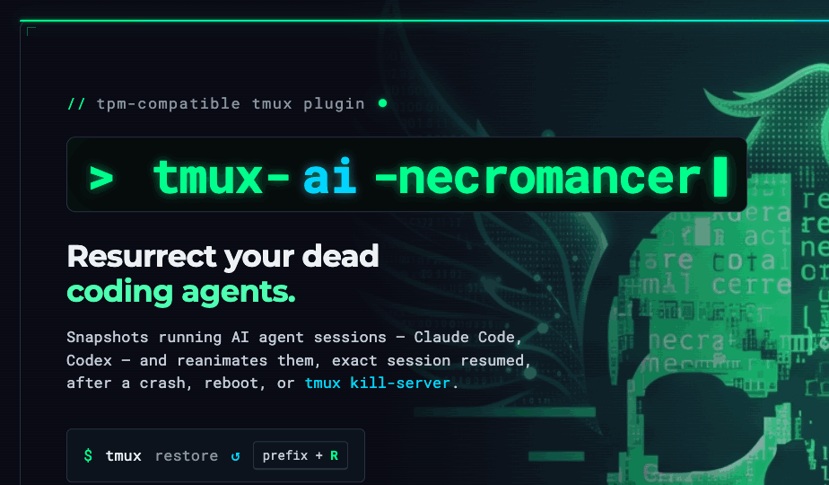

# tmux-ai-necromancer 🪦



> Bring your dead AI coding sessions back to life.

`tmux-ai-necromancer` is a [TPM](https://github.com/tmux-plugins/tpm)-compatible
tmux plugin that does for **AI coding agent sessions** what
[tmux-resurrect](https://github.com/tmux-plugins/tmux-resurrect) does for tmux
panes: it snapshots your running agent conversations on a timer and resurrects
them — with the exact session resumed — after a crash, reboot, or
`tmux kill-server`.

It is **multi-agent**: [Claude Code](https://claude.com/claude-code) and
[Codex](https://developers.openai.com/codex/cli/) work out of the box, and
adding another agent is one small adapter file.

Born from a real problem: tmux 3.6b crashes (heap corruption in copy mode) kept
killing a dozen live Claude Code sessions at once, with no way to get them back.

## What it does

- **Autosave** — every 5 minutes (configurable), walks every tmux pane and
  records each pane's agent + resumable session id to a JSONL snapshot. Runs in
  the background off the status bar; **never touches a running agent**.
- **Restore** — reads the latest snapshot and recreates sessions/windows,
  running the right resume command per agent (`claude --resume <id>`,
  `codex resume <id>`, …). **Idempotent** — safe to run repeatedly on a
  half-populated server; it fills gaps instead of duplicating windows or
  erroring out.
- **Reboot survival** — `prep`/`resume` wrappers that pair with tmux-resurrect +
  tmux-continuum to bring the whole layout (and every agent) back after a reboot.
- **Session viewer (TUI)** — a Go + Bubble Tea viewer/capture tool that joins
  live panes against the latest snapshot and can exit supported agents on demand.

## Install

### With TPM (recommended)

Add to `~/.tmux.conf`:

```tmux
set -g @plugin 'RonenMars/tmux-ai-necromancer'
```

Then press `prefix + I` to install. That's it — autosave starts immediately.

### Manual

```bash
git clone https://github.com/RonenMars/tmux-ai-necromancer \
  ~/.tmux/plugins/tmux-ai-necromancer
run-shell ~/.tmux/plugins/tmux-ai-necromancer/tmux-ai-necromancer.tmux  # in tmux.conf
```

### Dependencies

- `tmux` ≥ 3.0
- `python3` (JSON handling — ships with macOS)
- `jq` (restore/apply — `brew install jq`)
- `go` ≥ 1.21 (only to build the optional TUI)

## Usage

| Action | Command / key |
|---|---|
| Restore latest snapshot | `prefix + R` (popup), or `necro-restore.sh` |
| Manual snapshot (interactive) | `necro-snapshot.sh` |
| Manual snapshot (no disruption) | `necro-snapshot.sh --idle-only` |
| Restore a specific snapshot | `necro-restore.sh <file.jsonl>` |
| Dry-run a restore | `necro-restore.sh --dry-run` |
| Before reboot | `necro-reboot-prep.sh` |
| After reboot | `necro-reboot-resume.sh` |
| Session viewer | `make -C tui run` |

Scripts live in `scripts/` inside the plugin dir
(`~/.tmux/plugins/tmux-ai-necromancer/scripts/`). Add it to `PATH` or alias the
ones you use.

## Configuration

Set these in `~/.tmux.conf` **before** the line that loads TPM:

```tmux
set -g @necromancer_interval      '5'          # minutes between autosaves
set -g @necromancer_max_snapshots '20'         # autosave files to keep
set -g @necromancer_agents        'claude codex'  # which agents to track
set -g @necromancer_restore_key   'R'          # prefix key for restore popup
set -g @necromancer_snapshot_dir  '~/.claude/tmux-snapshots'  # where snapshots live
```

The snapshot dir defaults to `~/.claude/tmux-snapshots` (so it stays compatible
with prior Claude-only setups). Override with the option above or the
`NECROMANCER_SNAPSHOT_DIR` env var.

## How it works

Like tmux-continuum, the plugin appends a `#(...)` call to `status-right`. tmux
evaluates that on every status refresh; the script self-throttles to your
interval and, when due, runs a `--idle-only` snapshot in the background.

A snapshot is JSON Lines, one record per pane:

```json
{"pane_id":"%5","session":"tb-mobile","window_index":3,"window_name":"feat:x",
 "cwd":"/Users/you/dev/app","prev_cmd":"claude","agent":"claude",
 "uuid":"abc-…","uuid_source":"latest-jsonl","captured_at":"…",
 "first_user":"","last_assistant":"","dest_session":"","dest_window_name":""}
```

Session ids are captured two ways: scraping the agent's farewell line from
scrollback (high confidence, only on a clean interactive exit), or — the common
case for unattended autosave — a **filesystem fallback** that finds the
most-recent transcript for the pane's working directory.

Restore is keyed on a stable per-window marker (`@necro_id`), not window names
(which auto-rename) — so repeated restores never stack duplicates.

## Supported agents

| Agent | Transcript store | Resume |
|---|---|---|
| Claude Code | `~/.claude/projects/<cwd>/<uuid>.jsonl` | `claude --resume <uuid>` |
| Codex | `~/.codex/sessions/<date>/rollout-*-<uuid>.jsonl` | `codex resume <uuid>` |

Want another agent? See [`docs/agents.md`](docs/agents.md) — it's one file.

## License

MIT — see [LICENSE](LICENSE).
